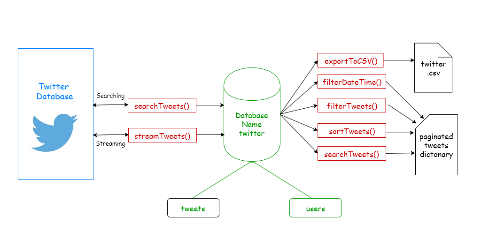

# Twitter-API
This API is for fetching and storing the target tweets with metadata

# Twitter Search/Streaming API
### Objectives
<ul>
<li>Trigger a twitter search/stream for recent high traffic events.</li>
<li> 
    Return stored tweets and their metadata based on applied filters/search.
    </li>
    <li> 
    Export data to csv file
    </li>
</ul>

#### Basic structure diagram of API

### Specifications
#### Programming language : Python
#### Database : MongoDB(NoSQL Database)
#### Data fetching method : Searching and Streaming

### Prerequisite
#### Python modules
<ul>
    <li>python-twitter</li>
    <li>pymongo</li>
    </ul>
    
#### Twitter authetication keys
In order to fetch the data from twitter we have to send a connection request to twitter servers with header. 
This header contains authetication parameters which are basically authetication tokens provided by twitter.
Following keys are needed in order to use the api:
<ul>
    <li>consumer_key</li>
    <li>access_token_key</li>
    <li>consumer_secret</li>
    <li>access_token_secret</li>
</ul>

#### MongoDB
There are two ways to work on mongoDB, either it could be installedd directly in our local system or use the free cloud database service.A URI is needed in case free cloud database is used. 
See resources for further details.

 

    
# API Functions

<ul>
    <li>configure()</li>
    <li>exportFilter()</li>
    <li>exportToCSV()</li>
    <li>filterDateTime()</li>
    <li>filterTweets()</li>
    <li>initialize()</li>
    <li>search()</li>
    <li>searchTweets()</li>
    <li>sortTweets()</li>
    <li>streamTweets()</li>
    <li>verify()</li>
    <li>viewBook()</li>   
    </ul>
    
# Getting Started

<b>1.</b> Import twitter_api as tap 
<b>2.</b> tap.configure(<b>consumer_key</b>='consumer_key',<b>access_token_key</b>='access_token_key',<b>tap.consumer_secret</b>='consumer_secret',
<b>tap.access_token_secret</b>='access_token_secret',<b>uri</b>='uri')
 <b>3.</b> tap.initialize()
 <b>4.</b> tap.searchTweets(keywords=['modi','AbkiBarModiSarkar','ModiForPM'],deliminiter='or',count=1000)
    <b>OR</b> tap.streamTweets(keywords=['modi','AbkiBarModiSarkar','ModiForPM'],deliminiter='or',count=1000)
 #### Now api is ready to be use. For further details check documentation and references.

### References
Standard Searching https://developer.twitter.com/en/docs/tweets/search/api-reference/get-search-tweets 
Stream Filtering  https://developer.twitter.com/en/docs/tweets/filter-realtime/guides/basic-stream-parameters 
Introduction to Tweet JSON https://developer.twitter.com/en/docs/tweets/data-dictionary/overview/intro-to-tweet-json 
Tweet data dictionaries https://developer.twitter.com/en/docs/tweets/data-dictionary/overview/tweet-object 
Link to get application tokens https://apps.twitter.com/ 
Guide to get application tokens https://github.com/bear/python-twitter/blob/master/doc/getting_started.rst 
Link to the guide to get URI https://docs.mongodb.com/manual/tutorial/atlas-free-tier-setup/ 
Download link to monogoBD https://www.mongodb.com/download-center
